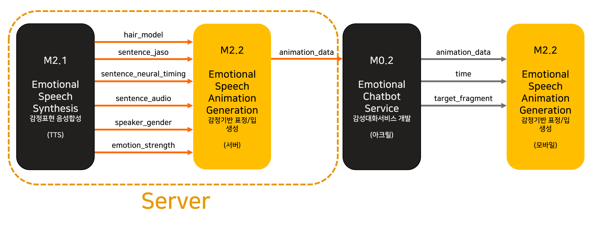

# Emotional Facial Animation - Server
This is the part of Emotional Facial Animation module for Flagship project by [Visual Media Lab, KAIST](http://vml.kaist.ac.kr).

***

## Note

* (2020/04/29) 4월 5차년도 베이스 코드 업데이트 되었습니다.

***

## System/SW Overview

* 본 시스템은 감정 기반 표정/입 생성 모듈의 서버 부분에 해당하며, 발화 텍스트, 발화 타이밍 정보, 오디오, 성별, 헤어 모델, 여섯 가지 감정별 세기를 입력으로 받아 해당되는 3D 얼굴 애니메이션 시계열 데이터를 xml 형태로 반환해주는 시스템입니다. 
* 아래 그림은 출력된 애니메이션 시계열 데이터를 본 모듈의 안드로이드 시스템을 통해 렌더링하였을 때 표현되는 예시 이미지입니다.


***

## How to Install

- Quick start 참조

***

## Main requirement

- OS: Ubuntu Linux 18.04 LTS
- Language: Python 3.7
- Framework : Docker Server 19.03.4, librosa 0.7.1, numpy 1.17.4
- 서버 – 클라이언트 간 작동 : HTTP RESTful API 제공 - flask 1.1.1

***

## Network Architecture and features

* 해당 사항 없음

***

## Quick start

- **Step 0. Building the Docker image**

  Clone this repo first. Then run this command on the bash prompt (INCLUDE THE PERIOD AT THE END):

  ```
  $ docker build -t flagship-emotional-facial-animation-server .
  ```

- **Step 1. Running the server from the Docker image**

  After building the image, run this command:
    ```
  $ docker run -d -p 3456:5000 flagship-emotional-facial-animation-server
    ```

Now the server runs on port 3456. Check http://localhost:3456/emotional-facial-animation/interactive by your web browser for assuring everything are working.


***

## HTTP-server API description

* /emotional-facial-animation/rest/generate-animation
* JSON parameters are:

|Parameter|Type|Description|
|---|---|---|
| sentence_jaso           | File (.txt) |자소 분해된 발화 텍스트(.txt 파일)|
| sentence_neural_timing  | File (.npy) |발화 텍스트의 자소가 발음되는 타이밍 정보를 2D array로 입력(.npy 파일)|
| sentence_audio_wav      | File (.wav) |발화 텍스트를 음성합성한 오디오 Mono Waveform을 입력(Sampling Rate: 8000Hz)|
| speaker_gender          | int         |화자 음성상의 성별.  성별은 서비스 코드 규약을 따름|
| hair_model              | int         |여자 모델의 헤어 스타일을 0 또는 1의 int값으로  입력|
| emotion_strength[10001] | int         |Happiness 감정의 표현 강도를 0~1 사이의 float 값으로 입력. 감정은 서비스 코드 규약을 따름|
| emotion_strength[10002] | int         |Anger 감정의 표현 강도를 0~1 사이의 float 값으로 입력. 감정은 서비스 코드 규약을 따름|
| emotion_strength[10003] | int         |Disgust 감정의 표현 강도를 0~1 사이의 float 값으로 입력. 감정은 서비스 코드 규약을 따름|
| emotion_strength[10004] | int         |Fear 감정의 표현 강도를 0~1 사이의 float 값으로 입력. 감정은 서비스 코드 규약을 따름|
| emotion_strength[10006] | int         |Sadness감정의 표현 강도를 0~1 사이의 float 값으로 입력. 감정은 서비스 코드 규약을 따름|
| emotion_strength[10007] | int         |Surprise 감정의 표현 강도를 0~1 사이의 float 값으로 입력. 감정은 서비스 코드 규약을 따름|

* Request
```
POST /emotional-facial-animation/rest/generate-animation 
data: {
    "sentence_jaso":"/dcf/handler/src/test_input/1GJCeQzy.txt",
    "sentence_neural_timing":"/dcf/handler/src/test_input/1GJCeQzy.npy",
    "sentence_audio_way":"/dcf/handler/src/text_input/1GJCeQzy.wav",
    "speaker_gender":"30001",
    "hair_model":"0",
    "emotion_strength":{"10001": 0.0, "10002": 0.0, "10003": 0.0, "10004": 0.0, "10005": 0.0, "10006": 0.0, "10007": 0.0}
}
```

* Response OK
```xml
<?xml version='1.0' encoding='utf-8'?>
<animation name="speech_animation">
	<gender gender="30001" />
	<emotion_strength>
		<emotion emotion="10001" strength="0.0" />
		<emotion emotion="10002" strength="0.0" />
		<emotion emotion="10003" strength="0.0" />
		<emotion emotion="10004" strength="0.0" />
		<emotion emotion="10006" strength="0.0" />
		<emotion emotion="10007" strength="0.0" />
	</emotion_strength>
	<keyframeList>
		<key t="0">
			<faceWeights>0.0 0.0 0.0 0.0 0.0 0.0 0.0 0.0 0.0 0.0 0.0 0.0 0.0 0.0 0.0 0.0 0.0 0.0 0.0 0.0 0.0 0.0 0.0 0.0 0.0 0.0 0.0 0.0 0.0 0.0 0.0 0.0 0.0 0.0 0.0 0.0 0.0 0.0 0.0 0.0 0.0 0.0 0.0 0.0 0.0 0.0 0.0 0.0 0.0 0.0 0.0 0.09830531626939774 0.0 0.04093131199479103 0.04783490635454655 0.0 0.0 0.016355020459741354 0.026090694405138493 0.3506091356277466 0.0 0.0021135821240022778 0.0 0.0 0.0 0.0 0.0 0.06582734845578671 0.0019327396992594005 0.0 0.0 </faceWeights>
			<headNodding>0.0 0.0 0.0</headNodding>
		</key>
		...(이하 key 값 생략)...
	</keyframeList>
</animation>
```

***

## Repository overview

* `emotion_animation_keys.blendshape_boy/` - contains man facial rig blendshape weights used in animation clip for 6 emotions and 3 different versions of each emotion
* `emotion_animation_keys.blendshape_boy/10001_0.json` – the numbers before and after underscore mean emotion and version, respectively (10001: happiness, 10002: anger, 10003: disgust, 10004: fear, 10006: sadness, 10007: surprise)
* `emotion_animation_keys.blendshape_girl/` - contains woman facial rig blendshape weights used in animation clip for 6 emotions and 3 different versions of each emotion
* `emotion_animation_keys.blendshape_girl/10001_0.json` – the numbers before and after underscore mean emotion and version, respectively (10001: happiness, 10002: anger, 10003: disgust, 10004: fear, 10006: sadness, 10007: surprise)
* `templates/interactive.html` - test page to check output (xml file) for input
* `classifiedBsNameList_boy.txt` - blendshape list classified by function for generating boy animation
* `classifiedBsNameList_girl.txt` – blendshape list classified by function for generating girl animation
* `bsNameList.txt` – total blendshape list used for generating animation
* `animation_data.xml` – return output (all necessary data for generating emotional speech animation) 
* `main.py` – main function
* `interactive.py` – intermediate function. process the input data and send it the required function
* `speech.py` – convert input (grapheme) to phoneme, map phoneme to viseme blendshape (such as AAA), and save viseme blendshape weights and timing
* `animation.py` – check blendshape list for generating animation and save blendshape weights and timing
* `emotion.py` – check blendshape list corresponding to input emotion and extract blendshape weights per frame. repeat the routine depending on input audio length
* `blending.py` – if the output is an emotional speech animation, not just speech animation, blend the weights of viseme and other blendshapes differently depending on the function (eye, lips, and mouth)
* `pitch.py` – detect head nod angle from pitch
* `time_series.py` – perform the mathematical calculations required for detecting head nod angle from pitch
* `exporting_output.py` – save data (gender, emotion, blendshape weights per frame, etc.) to xml fileconfiguration settings

